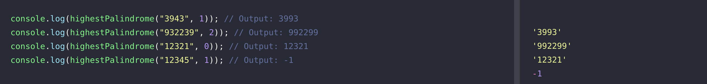

# Hitopia Problem Solving Test

### Soal nomor 1

Test Case:

### Soal nomor 2

Test Case:

Notes:
Kompleksitas algoritma diatas adalah O(n). Untuk kasus pada soal ini, kompleksitas terbaik yang bisa di dapatkan adalah O(n), mengingat dari fungsi yang diterapkan perlu mengecheck string satu per satu (code line:11)

### Soal nomor 3

Test Case:
